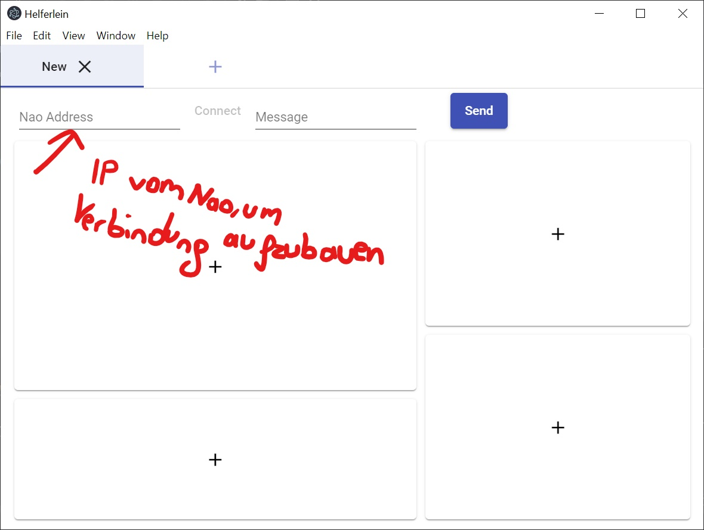
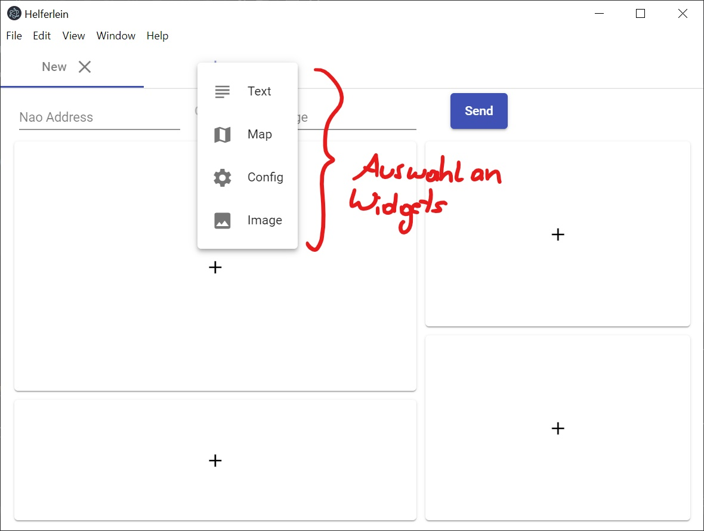
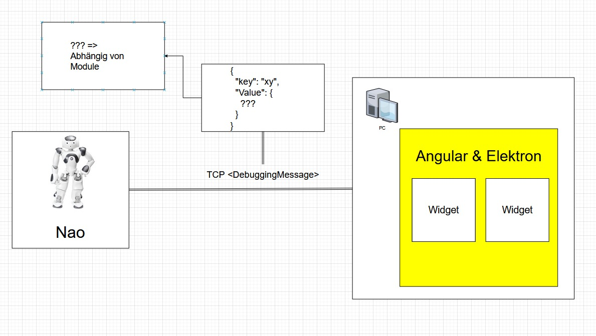

= Helferlein

https://1920-3ahitm-itp.github.io/02-project-repositories-robotic-soccer/index.html[*Index*,role=white]

== Allgemein

Das Helferlein wird zukünftig Mate ersetzten.
Es dient zur Datenüberwachung, Anzeige von Bildübertagungen
und sonstigen Informationsanzeige von Werten,
die vom Nao kommen, mit dem man verbunden ist.
Diese Werte verschickt der NAO als Key-Value Pairs im
Json-Format, wobei die Frequenz dieser Nachrichten einem
"Cycle" des Hauptprogrammes entspricht.
Also kurz beschrieben dient es zum Monitoring.
Man kann selbst bestimmen von welchen Keys man die Values sehen
will und diese werden, wenn man mit einem Nao verbunden ist
angezeigt.

== Benutzung

vom Helferleinverzeichnis aus:

----

cd robo-ducks-core/tools/helferlein/helferlein

----

zum Starten:

----
npm run electron
----

== Systemarchitektur

== JSON Beispiel

[source,json]
----

{
  "keys": [
{
    "isImage": true,
    "key": "Brain.LineDetection.top_image_lines"
},
{
    "key": "Brain.FootCollisionDetector.rightFoot",
    "timestamp": 40061,
    "value": 0
},
{
    "key": "Brain.FootCollisionDetector.leftFoot",
    "timestamp": 40061,
    "value": 0
}
          ]
}
----

== Beispiel für Anwendung

Nao glaubt er steht an seiner Position, was man dann an den angezeigten Werten erkennen kann,
jedoch steht er in Wirklichkeit an einer anderen Position am Feld.

https://1920-3ahitm-itp.github.io/02-project-repositories-robotic-soccer/sachbestand.html[Sachstand Helferlein,role=white]
